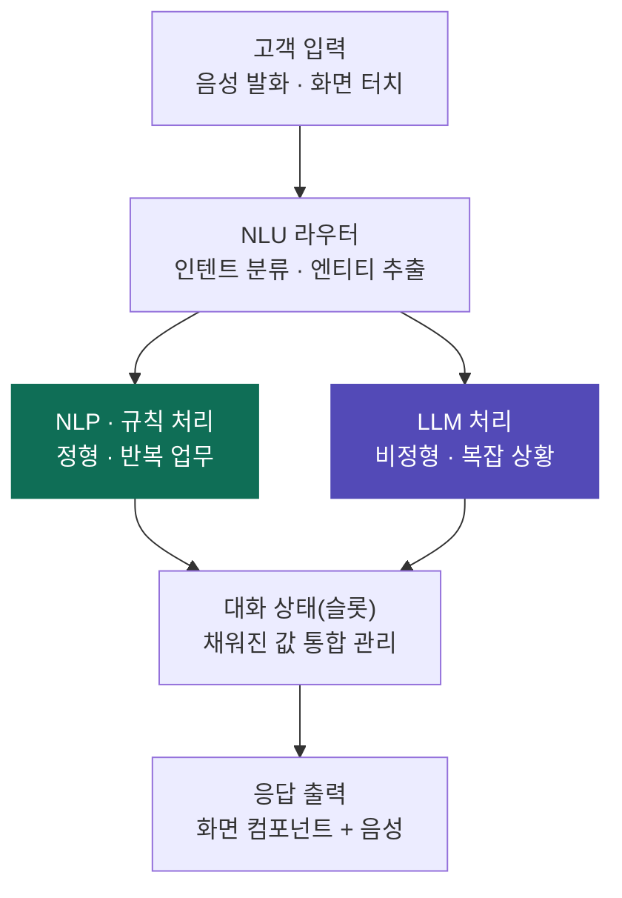

# 제품 요구사항 정의서 (PRD): AICC 보이는 콜봇

## 1. 프로젝트 개요 (Project Overview)

- **프로젝트명:** AICC 보이는 콜봇 (대화형 멀티모달 플랫폼)
- **목적:** 기존 음성 중심의 콜봇 한계를 극복하고, 고객이 직접 터치·입력·시각 자료를 활용할 수 있는 '보이는 콜봇' 경험 제공.
- **주요 타겟:**
  - **인바운드:** 복잡한 본인 인증, 서류 제출, 상세 정보 확인이 필요한 CS 고객.
  - **아웃바운드:** 미납 요금 안내 및 결제, 보험/계약 갱신, 해피콜 등 시각적 확인 및 즉각적인 액션(서명, 결제)이 필요한 타겟 고객.
- **개발 목표:** Vue.js 기반의 모바일 반응형 웹(또는 App-in-App)으로 구현. 기획 단계에서 바이브 코딩(Claude Code 등)을 활용해 동작 가능한 데모를 사전 구축하여 개발 및 영업 효율성 극대화.
- **데모 목표:** 음성 상담 → 화면 전환의 자연스러움과 Vision 기반 캡처 분석의 임팩트를 시연하여, 기존 보이는 ARS 대비 차별성을 증명하고 고객사(증권사 등) 수주로 연결.

## 2. 진입 시나리오 (Entry Scenarios)

일반 콜봇에서 보이는 콜봇으로 넘어가는 핵심 시나리오입니다. 비즈니스 현실(수백억 원의 SDK 제휴 비용 및 iOS 강제 팝업 불가 등)을 반영하여 전화 채널은 '알림톡/문자 링크(URL) 우회 진입 방식'을 메인 서비스 모델로 채택합니다.

진입 경로는 **채널(전화 / 앱) × 방향(인바운드 / 아웃바운드)**의 2×2로 구분합니다. 채널·방향에 따라 인증·신뢰·진입 방식이 달라집니다.

| 방향 \ 채널 | 전화 | 앱 |
| --- | --- | --- |
| 인바운드 (고객이 문의) | 2.1 전화 상담 중 화면 전환 | 2.3 앱 문의 중 진입 |
| 아웃바운드 (기업이 접촉) | 2.4-A 안내콜 + 링크 우선 | 2.4-B 앱 푸시 진입 |

아래 2.1·2.2는 그중 **전화·인바운드** 기준의 상세 플로우입니다.

### 2.1 링크 진입 상세 플로우 (정상 흐름 / Happy Path)

1. **안내 및 발송:** 콜봇이 "화면을 보면서 진행하겠습니다. 카카오톡 링크를 눌러주세요. 통화는 스피커폰으로 전환하시면 편리합니다"라고 안내 후 링크 발송.
2. **수신 및 클릭:** 고객이 폰 화면에서 알림톡 링크 터치.
3. **웹뷰 로딩:** 기본 브라우저가 열리며 Vue.js 앱 렌더링. WebSocket으로 현재 통화 세션 즉시 동기화.
4. **시각적 환영:** 화면 중앙에 AI 파동 애니메이션 작동.
5. **상황 동기화 안내:** 고객 진입 감지 시, 콜봇이 즉각 "접속을 확인했습니다. 화면에서 조회하실 종목을 선택해 주세요"라고 상황 맞춤형 음성 안내.
6. **멀티모달 액션:** 고객은 화면을 터치해 입력하며, 동시에 음성으로도 질문 가능.

### 2.2 예외 상황 및 대처 시나리오 (Edge Cases)

고객이 안내를 이해하지 못하거나 조작에 서툰 경우를 대비한 대처 방안입니다.

**Case 1. 링크 발송 후 고객 반응 없음 (Timeout)**
- 상황: 15초 이상 웹소켓 연결(화면 진입) 신호가 없는 경우.
- 대처: "아직 링크를 누르지 않으셨네요. 화면 조작이 어려우시다면, 지금 통화 상태 그대로 저에게 천천히 말씀해 주셔도 됩니다." (음성 모드로 자연스러운 Fallback)

**Case 2. 문자를 확인하려다 실수로 통화 종료 (Call Drop)**
- 상황: 화면 전환 중 실수로 '전화 끊기'를 누른 경우.
- 대처: 끊어진 지 3초 이내에 콜봇이 즉시 재발신하여 "실수로 전화가 끊어지신 것 같아 다시 연락드렸습니다. 방금 보내드린 링크를 눌러주세요" 안내. (또는 화면 진입 시 "통화 복구하기" 팝업 노출)

**Case 3. 화면 접속 후 조작 미숙 (Stuck)**
- 상황: 화면 진입은 했으나 10초 이상 터치/스크롤 등 액션이 없는 경우.
- 대처: "화면에 잘 접속하셨네요! 지금 화면 중간에 깜빡이는 빈칸을 터치하시고 입력해 주시면 됩니다." (화면 내 특정 영역 하이라이트 애니메이션 추가)

### 2.3 앱 진입 시나리오 (App-in-App / 인앱) — 인바운드

- **진입:** 고객이 자사 앱 사용 중 문의 발생 → 앱 내에서 보이는 콜봇 호출(인앱 화면 또는 인앱 통화). 별도 링크 전송·웹뷰 진입 불필요.
- **앱 채널 특성 (전화 채널과의 차이):**
  - 이미 로그인된 상태 → 본인인증 부담 최소, 신뢰 확보 용이(피싱 우려 없음).
  - 통화 세션 바인딩 토큰 불필요(앱이 세션을 직접 소유).
  - 카메라/마이크/파일 권한을 앱 권한으로 일괄 처리 가능(웹뷰·인앱 브라우저 권한 제약 회피).
  - 캡처 동작(전원+볼륨) 자동 감지 → "방금 캡처한 화면을 AI 상담사에게 전송할까요?" 팝업(4장 와우 포인트와 연결).
- **음성은 선택:** 인앱은 텍스트+화면 중심 진행도 가능하며, 필요 시 인앱 음성(VoIP) 연결.

### 2.4 아웃바운드 진입 시나리오 (기업이 접촉)

대상 업무: 미납 요금 안내·결제, 보험/계약 갱신, 해피콜 (1장 아웃바운드 타겟). 아웃바운드는 보이스피싱과 구조가 유사해 신뢰 확보가 진입 설계의 핵심.

**2.4-A 전화 아웃바운드**
- **기본 권장안 (화면 우선 / Screen-first):** 갑작스러운 음성콜 대신 **검증된 알림톡 링크를 먼저 발송 → 고객이 탭하면 화면 진입 → 필요 시 음성 연결.** 갑작스러운 발신보다 피싱 마찰이 작음.
- **대안:** 안내콜 진행 중 2.1과 동일하게 링크로 화면 전환.
- **필수 신뢰 장치:** 브랜드·발신번호 검증 표기(안심마크), 결제 단계는 PG 결제창/토큰화 위임(카드번호 직접 수집 지양). → 비기능(보안) 요구사항과 연계.

**2.4-B 앱 아웃바운드**
- 앱 푸시 알림(갱신/미납 안내 등) → 탭 → 인앱 보이는 콜봇 진입. 이미 로그인 상태라 신뢰·인증 부담 최소.

## 3. 핵심 기능 정의 (Core Features)

| 기능 분류 | 상세 기능 설명 | 비고 |
| --- | --- | --- |
| 하이브리드 인터랙션 | • 음성 발화와 터치(버튼 클릭, 타이핑) 입력을 동시에 지원 • 콜봇 응답을 음성(TTS)과 시각적 피드백(화면)으로 동시 제공 | WebSocket 동기화 |
| 멀티모달 액션 | • 이미지/카메라 전송: 기기 고장 상황 직접 촬영, 신분증 OCR 연동 • 오류 화면 캡처 연동: 에러 화면 캡처 시 Vision AI 분석 (웹/앱 환경 맞춤 지원) • 실시간 서식 입력: 주소, 결제 정보 등 폼(Form) 직접 입력 | |
| 상황 동기화 | • 고객의 화면 스크롤/버튼 체류 시간을 콜봇이 인지하여 선제적 안내 | |
| 반응형 UI | • 모바일 최적화 (Mobile-first) 설계, 데스크탑/태블릿 호환 | Vue.js |

## 4. 와우 포인트 (Wow Point: 차별화 요소)

- **비전(Vision) AI 기반 캡처 분석 및 코브라우징 (환경별 맞춤 시나리오):**
  - **웹 브라우저 (링크 진입) 환경:** 콜봇 안내에 따라 '최근 캡처 사진 올리기' 원클릭 액션을 통해 최소한의 터치로 신속하게 오류 화면 전송 및 AI 원인 분석.
  - **자사 앱 내 통화 (App-in-App) 환경:** 고객이 캡처(전원+볼륨)하는 동작을 앱이 백그라운드에서 자동 감지하여 "방금 캡처한 화면을 AI 상담사에게 전송할까요?"라는 팝업을 즉시 노출. 터치 한 번으로 원스톱 분석 가능.
- **다이내믹 UI 렌더링 (Server-driven UI):** 고정된 화면이 아닌, 상황(의도)에 맞는 UI 컴포넌트(차트, 표 등)를 사전 정의된 컴포넌트 팔레트에서 골라 조립해 제공. (LLM이 매번 자유롭게 생성하는 방식이 아니라, 7장의 고정 팔레트 + 서버 주도 노출 방식)

## 5. 목업 데이터(Mock Data) 중앙 관리 전략

데모 구현 시 데이터 정합성 유지 및 향후 백엔드 전환의 용이성을 위해 목업 데이터를 중앙집중형으로 관리. MSW(Mock Service Worker) 또는 전역 상태(Store)를 활용해 실제 API 통신과 동일한 환경을 구성하여 데이터 정합성(등록/수정 결과의 즉각적 화면 반영) 보장.

또한 목업 데이터는 단순 정적 값이 아니라 **시나리오 흐름(단계별 스크립트: 봇 발화 → 노출 컴포넌트 → 사용자 액션 → 다음 단계)**을 함께 담아, 데모가 단계별로 재생되도록 구성한다. 즉 목업은 **"진입 컨텍스트 + 슬롯 상태 + 시나리오 스크립트"** 세 덩어리로 구성된다.

## 6. 데모 메인 화면 UI/UX 주요 구성

- **현재 통화 상태창:** 상단에 "AI 상담사와 통화 중입니다" 텍스트 및 통화 타이머 배치
- **멀티모달 AI 파동(Wave) 애니메이션:** 화면 중앙에 위치하여 AI가 듣고 말하고 있음을 시각적이고 직관적으로 표현
- **실시간 자막 (STT/TTS):** 콜봇의 음성 안내와 고객의 발화를 텍스트로 노출 (채팅 형태)
- **고객 맞춤형 퀵 버튼 (멀티모달 액션):** 하단에 즉각적인 액션(사진/캡처 전송, 결제 폼 입력 등)을 위한 터치 버튼 배치

## 7. 인터랙션 설계 방향 (Interaction Model)

- **대화 주도(Conversation-led) 방식 채택:** 사용자가 화면 메뉴를 탐색하는 '메뉴 주도' 방식이 아니라, 봇이 대화 흐름에 맞춰 그 단계에 필요한 화면을 능동적으로 노출하는 방식을 채택. (메뉴 주도는 기존 보이는 ARS 수준이라 차별성 부족)
- **음성·터치 통합 (멀티모달 슬롯):** 봇은 대화 상태(채워진/비어 있는 정보 = 슬롯)를 관리하고, 사용자는 동일한 슬롯을 음성으로 말하거나 화면에 입력하여 채움. 화면은 음성으로 하기 불편한 입력(카드번호, 주소, 서명, 캡처)을 받는 보조 입력 채널.
- **고정 컴포넌트 팔레트 + 서버 주도 노출:** UI를 LLM이 매번 자유롭게 생성(완전 Generative UI)하지 않고, 사전 정의된 컴포넌트 팔레트(결제 폼, 인증 카드, 업로드, 선택지, 결과 카드 등)를 봇이 골라 배치하는 방식. (일관성·접근성·신뢰 확보 목적)
- **(검토 필요) 통합 대화 상태 관리:** 음성 이벤트와 화면 터치 이벤트를 하나의 대화 상태로 합치는 처리 규칙 정의 필요. 예) 사용자가 예상치 못한 칸을 터치하거나 입력 중 다른 질문을 할 때의 상태 처리.
- **단일 프론트엔드 + 채널 분기:** 전화/앱 채널 모두 동일한 Vue 웹앱(전화=링크·웹뷰, 앱=WebView 임베드)으로 구동. 화면을 채널별로 따로 만들지 않고, 채널 차이는 "진입 파라미터 + 기능 플래그"로 분기 처리.
- **컴포넌트의 채널 비종속(Channel-agnostic) 설계:** 컴포넌트가 특정 채널에 묶이지 않도록, 진입 컨텍스트(채널·세션·고객정보·시나리오)를 props/스토어로 주입받는 구조로 설계. 향후 채널 어댑터(웹/앱) 연결 시 화면 수정 없이 확장 가능.

## 8. 처리 아키텍처 (NLP / LLM 하이브리드)

모든 입력을 LLM으로 처리하지 않고, NLU(NLP)가 먼저 처리하다가 감당이 어려운 것만 LLM으로 넘기는 하이브리드 라우팅 구조를 채택.

- **처리 흐름:** 고객 입력(음성·터치) → NLU 라우터(인텐트 분류·엔티티 추출) → [정형·반복 업무 = NLP/규칙] 또는 [비정형·복잡 상황 = LLM] → 대화 상태(슬롯) 통합 → 응답 출력(화면 컴포넌트 + 음성)

> 색상 범례: NLP·규칙 = 저비용·고속(teal) / LLM = 유연·비용 큼(purple)
- **NLP/규칙 처리 영역 (저비용·고속·예측 가능):** 인텐트 분류(요금 조회·결제·본인인증 등 정형 의도), 엔티티/슬롯 추출(금액·날짜·카드번호·주소), 금칙어·필수문구 탐지, 감정 분석. ※ STT(음성→텍스트)는 별도 음성인식 모델.
- **LLM 처리 영역 (유연·고비용):** 예상치 못한 자유 발화, NLU 신뢰도가 낮을 때의 의도 해소, 캡처 오류 화면의 Vision 분석, 노출할 화면 컴포넌트 선택 판단.
- **라우팅 원칙:** NLU가 높은 신뢰도로 처리 가능하면 그대로 처리, 신뢰도가 낮거나 비정형이면 LLM으로 폴백.
- **온프레미스 배포 함의:** 고객사별 온프레미스 배포 시 LLM은 GPU 비용 부담이 크고 NLU 모델은 경량으로 탑재 용이. "정형 업무는 경량 NLU로 온프레미스, LLM은 최소화" 구조가 비용·납품 양면에서 유리(영업 논리로도 활용 가능).

## 9. 데모 메인 화면 영역(Zone) 구성

6장 UI 요소를 다음 5개 영역으로 구조화. (위에서 아래 순)

1. **헤더 — 신뢰 · 통화 상태:** 브랜드명·안심마크(보이스피싱 우려 대응) 상단 고정 + "○○○님과 통화 중" + 통화 타이머.
2. **AI 파동 애니메이션 — 턴테이킹 신호:** 봇이 듣는 중/말하는 중을 시각화하여 사용자가 말할/입력할 타이밍을 직관적으로 인지.
3. **메인 콘텐츠 영역 (가변):** 봇이 단계별로 노출하는 컴포넌트(결제 폼, 인증, 업로드, 캡처 분석 결과 등). '한 화면 한 과업' 원칙.
4. **실시간 자막 (STT/TTS):** 음성을 못 들었거나 소음 환경·청각 약자를 위한 백업 채널.
5. **하단 고정 퀵바 — 전역 액션:** 상담사 연결 / 음성으로 전환 / 캡처 전송 등. 항상 같은 자리에 고정.

**디자인 원칙:** 한 손 조작·주의 분산·고령층 사용 가능성을 전제로 한 화면 디자인 원칙(큰 터치 타깃·고대비·음성-화면 동조 등)은 → [`docs/design.md`](./design.md) 참고.

## 10. 데모 시작 화면 (채널별 진입 연출)

데모는 백엔드 없이 동작 흐름을 "보여주기(목업)" 방식으로 연출. 채널별로 시작 화면을 다르게 두되, 진입 후에는 9장의 동일한 메인 화면으로 수렴(진입 컨텍스트만 주입).

- **전화 시작 화면:** URL 알림(알림톡/문자) 수신 화면 → 링크 탭 → 보이는 콜봇 화면 연결. 미인증·문자 링크 진입 맥락이라 신뢰 헤더(브랜드·안심마크)와 통화 연결 상태를 강조.
- **앱 시작 화면:** 자사 앱 화면에서 '보이는 콜봇' 버튼 노출 → 버튼 탭 → 화면 연결. 이미 로그인된 신뢰 환경이라 별도 신뢰 장치 최소화하고 바로 본론으로 진입.
- **공통:** 시작 화면(전화/앱) 2종 → 진입 후 동일 메인 화면. 아웃바운드는 별도 시작 화면 없이 채널 시작 화면을 재사용하고 진입 컨텍스트(연락 사유 등)만 다르게 주입.

## 11. 컴포넌트 팔레트 (Component Palette)

화면은 7장 원칙대로 "항상 떠 있는 셸(구조) 컴포넌트"와 "봇이 메인 영역(zone 3)에 상황에 맞게 갈아 끼우는 콘텐츠 팔레트"로 구성. 모든 입력형 컴포넌트는 대화 상태의 특정 슬롯을 채우는 동작으로 통일.

### 셸(구조) 컴포넌트 — 항상 존재 (zone 1·2·4·5)

- **TrustHeader (신뢰 헤더):** 브랜드명·안심마크·통화 상태·타이머. 전화 채널에서 특히 강조.
- **WaveIndicator (AI 파동):** 봇의 대기/듣는 중/말하는 중 상태를 시각적으로 표현(턴테이킹 신호). 시각 구현 형태(글로우 오브 / 시리식 파형)와 색·모션 디테일은 → [`docs/design.md`](./design.md) 참고. 미관뿐 아니라 상태 구분(턴테이킹) 기능을 반드시 유지.
- **LiveCaption (실시간 자막):** 봇·고객 발화를 채팅 형태로 노출.
- **QuickActionBar (퀵바):** 상담사 연결 / 음성 전환 / 캡처 전송 등 전역 액션.

### 콘텐츠 팔레트 — 봇이 갈아 끼움 (zone 3)

| 컴포넌트 | 역할 | 핵심 데이터/슬롯 | 주 사용 시나리오 |
| --- | --- | --- | --- |
| InfoMessageCard | 상황·사유 시각 안내 | 제목, 본문, 아이콘 | 공통, 아웃바운드 연락 사유 |
| ChoiceButtons | 선택지 제시(퀵 리플라이) | 옵션 목록, 선택값 | 공통, 메뉴 분기 |
| DataCard | 구조화 정보 표시 | 항목 리스트/표/간단 차트 | 요금 내역, 계약 정보 확인 |
| FormInput | 서식 입력 | 필드 정의, 입력값(슬롯) | 주소·이름 등 정보 입력 |
| IdentityVerify | 본인인증 | 인증 방식, 진행 상태 | 본인인증 |
| PaymentForm | 결제 | 금액, 결제수단, 결제 상태 | 미납 결제, 갱신 결제 |
| FileUpload | 파일·촬영 업로드 | 용도(신분증/서류/오류캡처), 첨부물 | 서류 제출, 오류 캡처 |
| AnalysisResult | AI 분석 결과 표시 | 분석 요약, 원인, 해결안 | 오류 화면 Vision 분석 |
| SignaturePad | 전자서명 | 서명 이미지, 서명 완료 여부 | 계약·동의 서명 |
| ResultCard | 처리 완료·결과 | 결과 상태, 요약, 영수증 | 결제 완료, 처리 완료 |

### 구현 메모

- **결제(PaymentForm)는 데모라도 카드번호 직접 수집 지양.** "금액 표시 + PG 결제창 열기(목업)" 형태로 구성해 실연동과 어긋나지 않게 함. 보이스피싱 신뢰 이슈와 직결.
- **모든 입력형 컴포넌트는 "슬롯을 채운다"로 통일** (FormInput·IdentityVerify·PaymentForm·SignaturePad·FileUpload). 음성·터치 통합(7장) 유지 목적.
- **1차 데모 핵심 컴포넌트(12장 시나리오 기준):** InfoMessageCard, ChoiceButtons(또는 FormInput), IdentityVerify, DataCard, FileUpload, AnalysisResult부터 구현 → 한 시나리오를 끝까지 시연 후 나머지(PaymentForm·SignaturePad·ResultCard 등) 확장.

## 12. 1차 데모 시나리오 (내 보유 종목 조회)

첫 데모로 구현할 대표 시나리오. 세부 스크립트·데이터는 개발하면서 구체화하며, 여기서는 합의된 흐름만 기록.

- **채널 / 방향:** 전화 인바운드
- **주제:** 고객이 자신의 보유 종목을 조회 (본인인증을 자연스럽게 포함시키기 위해 "내 보유 종목"으로 설정)
- **흐름 (5단계 + 와우 연출):**
  1. 진입 + 환영 — 음성 상담 중 링크 탭 → 화면 연결 (InfoMessageCard)
  2. 종목 선택/검색 — "어떤 종목이 궁금하세요?" (ChoiceButtons 또는 FormInput)
  3. 본인인증 — 휴대폰 뒷자리 4자리 입력 (IdentityVerify) ※ 종목 선택 *후* 인증. 데모 한정 간이 방식이며 실서비스에선 실제 인증수단으로 대체
  4. 내 보유 종목 정보 표시 — 현재가·등락률·평가손익 등 (DataCard). 의도에 따라 차트/표/상세를 골라 보여줌으로써 다이내믹 UI(와우 ②)도 함께 노출
  5. 와우 포인트 연출 (캡처 분석, 와우 ①) — 정보 확인 중 "앱에서 매도가 안 돼요" 등으로 전환 → 오류 화면 캡처 업로드(FileUpload) → AI 분석 결과(AnalysisResult)로 원인·해결안 표시
  6. (선택) 후속 액션 — 관심등록 / 상담사 연결 (ChoiceButtons)
- **와우 포인트 연출 방식 (A안: 스크립트):** 실제 Vision 인식 없이, 올린 이미지에 대해 미리 정해둔 분석 결과를 보여주는 방식(순수 프론트엔드, 백엔드 불필요). 영업 데모의 안정성 확보 목적.
  - 오류 화면 이미지 2~3종을 준비하고 각각 다른 결과를 매핑(늘 같은 답이면 들킴).
  - "화면 분석 중..." 로딩 연출로 처리하는 것처럼 보이게 함.
  - 결과가 이미지의 구체적 요소를 짚도록 작성(예: "화면 상단의 '주문가능금액 부족' 메시지로 보아…") → 실제 인식처럼 보이게.
  - ※ 데모는 연출이며 실제 Vision 연동은 후속 과제. 고객에게 현재 역량으로 과대표현하지 않도록 내부적으로 선을 둠.
- **사용 컴포넌트:** InfoMessageCard, ChoiceButtons(또는 FormInput), IdentityVerify, DataCard, FileUpload, AnalysisResult
- **데이터:** 시세·보유 정보 및 캡처 분석 결과는 모두 목업(실시간/실인식 불필요), 화면이 그럴듯해 보이는 현실적 더미 값 사용
- **음성(TTS):** 봇 음성 안내에 TTS 적용을 전제로 함. 실제 적용 여부 및 방식(개발용 브라우저 내장 vs 시연용 사전 녹음 신경망 TTS)은 추후 결정. 음성 재생 시 WaveIndicator '말하는 중' 상태 + 자막(LiveCaption) 동기화.

## 13. 디자인 톤 & 가이드

디자인 톤·색 팔레트·반응형 전략·디자인 주의사항 등 시각/스타일 관련 사양은 별도 문서로 분리했다.

→ **디자인 상세: [`docs/design.md`](./design.md) 참고.**
